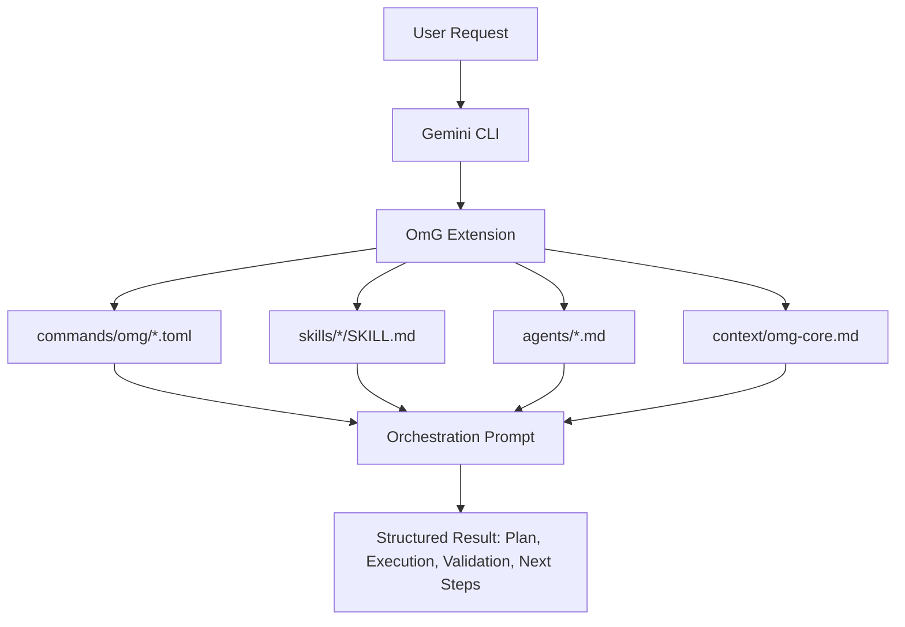
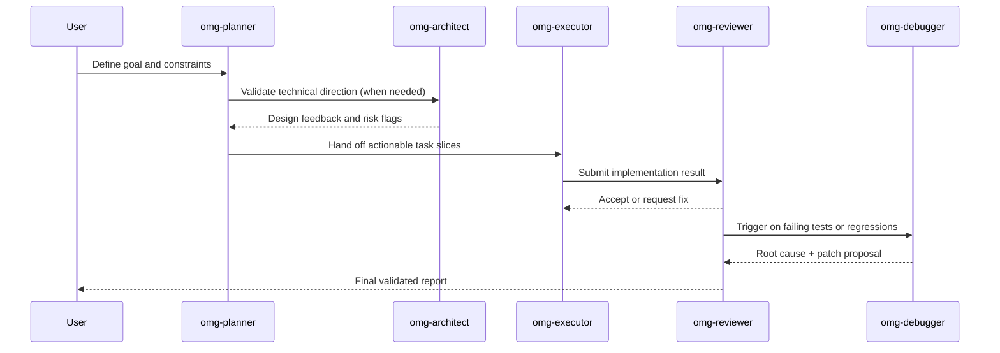

# oh-my-gemini-cli (OmG)

[Landing Page](https://joonghyun-lee-frieren.github.io/oh-my-gemini-cli/) | [History](docs/history.md)

[한국어](docs/README_ko.md) | [日本語](docs/README_ja.md) | [Français](docs/README_fr.md) | [中文](docs/README_zh.md) | [Español](docs/README_es.md)

Context-engineering-powered multi-agent workflow pack for Gemini CLI.

> "Claude Code's core competitiveness isn't the Opus or Sonnet engine. It's Claude Code itself. Surprisingly, Gemini works well too when attached to Claude Code."
>
> - Jeongkyu Shin (CEO of Lablup Inc.), from a YouTube channel interview

This project started from that observation:
"What if we bring that harness model to Gemini CLI?"

OmG extends Gemini CLI from a single-session assistant into a structured, role-driven engineering workflow.

## What's New in v0.3.2

- Added HUD profile controls for extension-native visual status rendering:
  - `/omg:hud`
  - `/omg:hud-on`
  - `/omg:hud-compact`
  - `/omg:hud-off`
  - `$hud`
- Upgraded `/omg:status` format to support HUD visibility profiles (`normal`, `compact`, `hidden`)
- Added HUD runtime state convention: `.omg/state/hud.json`
- Clarified Gemini extension boundary: visual summaries are prompt-driven and state-driven, not terminal hook injection
- Improved local dashboard HUD behavior: added top HUD line, `h` key toggle (`normal -> compact -> hidden`), and sync with `.omg/state/hud.json`

## At A Glance

| Item | Summary |
| --- | --- |
| Delivery model | Official Gemini CLI extension (`gemini-extension.json`) |
| Core building blocks | `agents/`, `commands/`, `skills/`, `context/` |
| Main use case | Complex implementation tasks that need plan -> execute -> review loops |
| Control surface | `/omg:*` commands + `$skill` workflows + sub-agent delegation |
| Default model strategy | Planning/architecture on `gemini-3.1-pro`, execution-heavy work on `gemini-3.1-flash` |

## Why OmG

| Problem in raw single-session flow | OmG response |
| --- | --- |
| Context gets mixed across planning and execution | Role-separated agents with focused responsibilities |
| Hard to keep progress visible in long tasks | Explicit workflow stages and command-driven status checks |
| Repetitive prompt engineering for common jobs | Reusable skill templates (`$plan`, `$team`, `$research`) |
| Drift between "what was decided" and "what was changed" | Review and debugging roles inside the same orchestration loop |

## Architecture



## Team Workflow



## Install

Install from GitHub using the official Gemini Extensions command:

```bash
gemini extensions install https://github.com/Joonghyun-Lee-Frieren/oh-my-gemini-cli
```

Verify in interactive mode:

```text
/extensions list
```

Verify in terminal mode:

```bash
gemini extensions list
```

Run a smoke test:

```text
/omg:status
```

Note: extension install/update commands run in terminal mode (`gemini extensions ...`), not in interactive slash-command mode.

## Interface Map

### Commands

| Command | Purpose | Typical timing |
| --- | --- | --- |
| `/omg:status` | Summarize progress, risks, and next actions | Start/end of a work session |
| `/omg:hud` | Inspect or switch visual HUD profile (`normal`, `compact`, `hidden`) | Before long sessions or when terminal density changes |
| `/omg:hud-on` | Quick toggle HUD to full visual mode | When returning to full status boards |
| `/omg:hud-compact` | Quick toggle HUD to compact mode | During dense implementation loops |
| `/omg:hud-off` | Quick toggle HUD to hidden mode (plain status sections) | When visual blocks are distracting |
| `/omg:intent` | Classify task intent and route to the correct stage/command | Before planning or coding when request intent is ambiguous |
| `/omg:rules` | Activate task-conditional guardrail rule packs | Before implementation on migration/security/performance-sensitive work |
| `/omg:deep-init` | Build deep project map and validation baseline for long sessions | At project kickoff or when onboarding into unfamiliar codebases |
| `/omg:team` | Execute full stage pipeline (`plan -> prd -> exec -> verify -> fix`) | Complex feature or refactor delivery |
| `/omg:team-plan` | Build dependency-aware execution plan | Before implementation |
| `/omg:team-prd` | Lock measurable acceptance criteria and constraints | After planning, before coding |
| `/omg:team-exec` | Implement a scoped delivery slice | Main implementation loop |
| `/omg:team-verify` | Validate acceptance criteria and regressions | After each execution slice |
| `/omg:team-fix` | Patch only verified failures | When verification fails |
| `/omg:loop` | Enforce repeated `exec -> verify -> fix` cycles until done/blocker | Mid/late delivery when unresolved findings remain |
| `/omg:mode` | Inspect or switch operating profile (`balanced/speed/deep/autopilot/ralph/ultrawork`) | At session start or posture change |
| `/omg:autopilot` | Run iterative autonomous cycles with checkpoints | Complex autonomous delivery |
| `/omg:ralph` | Enforce strict quality-gated orchestration | Release-critical tasks |
| `/omg:ultrawork` | Throughput mode for batched independent tasks | Large backlogs |
| `/omg:consensus` | Converge on one option from multiple designs | Decision-heavy moments |
| `/omg:launch` | Initialize persistent lifecycle state for long tasks | Beginning of long sessions |
| `/omg:checkpoint` | Save compact checkpoint and resume hint | Mid-session handoff |
| `/omg:stop` | Gracefully stop autonomous mode and preserve progress | Pause/interrupt moments |
| `/omg:optimize` | Improve prompts/context for quality and token efficiency | After a noisy or expensive session |
| `/omg:cache` | Inspect cache and context behavior | Long-running context-heavy tasks |

### Skills

| Skill | Focus | Output style |
| --- | --- | --- |
| `$deep-init` | Initialize deep repository map and validation baseline | Architecture/risk map + onboarding handoff |
| `$hud` | Manage visual status profile for status rendering | HUD profile + preview line |
| `$intent` | Route ambiguous requests into the correct OmG stage | Intent classification + next-command recommendation |
| `$rules` | Inject conditional guardrail rule packs | Trigger matrix + active policy set |
| `$plan` | Convert goals into phased plan | Milestones, risks, and acceptance criteria |
| `$ralplan` | Strict, stage-gated planning with rollback points | Quality-first execution map |
| `$execute` | Implement a scoped plan slice | Change summary with validation notes |
| `$prd` | Convert requests into measurable acceptance criteria | PRD-style scope contract |
| `$team` | Full orchestration across roles | Combined multi-agent report |
| `$loop` | Enforce iterative exec/verify/fix until completion or blocker | Cycle status board + unresolved backlog |
| `$autopilot` | Autonomous stage-loop execution | Cycle board with blockers |
| `$ralph` | Strict verification-gated orchestration | Gate board + ship decision |
| `$ultrawork` | Batch throughput execution | Shard board + periodic gates |
| `$consensus` | Option comparison and convergence | Decision matrix + chosen path |
| `$mode` | Mode/profile switching | Active posture + recommended next command |
| `$cancel` | Graceful stop with resume handoff | Lifecycle stop summary |
| `$research` | Explore options/tradeoffs | Decision-oriented comparison |
| `$context-optimize` | Improve context structure | Compression and signal-to-noise adjustments |

### Sub-agents

| Agent | Primary responsibility | Preferred model profile |
| --- | --- | --- |
| `omg-architect` | System boundaries, interfaces, long-term maintainability | `gemini-3.1-pro` |
| `omg-planner` | Task decomposition and sequencing | `gemini-3.1-pro` |
| `omg-product` | Scope lock, non-goals, and measurable acceptance criteria | `gemini-3.1-pro` |
| `omg-executor` | Fast implementation cycles | `gemini-3.1-flash` |
| `omg-reviewer` | Correctness and regression risk checks | `gemini-3.1-pro` |
| `omg-verifier` | Acceptance-gate evidence and release-readiness checks | `gemini-3.1-pro` |
| `omg-debugger` | Root-cause analysis and patch strategy | `gemini-3.1-pro` |
| `omg-consensus` | Option scoring and decision convergence | `gemini-3.1-pro` |
| `omg-researcher` | External option analysis and synthesis | `gemini-3.1-pro` |
| `omg-quick` | Small, tactical fixes | `gemini-3.1-flash` |

## Context Layer Model

| Layer | Source | Goal |
| --- | --- | --- |
| 1 | System / runtime constraints | Keep behavior aligned with platform guarantees |
| 2 | Project standards | Preserve team conventions and architecture intent |
| 3 | `GEMINI.md` and shared context | Maintain stable long-session memory |
| 4 | Active task brief | Keep current objective and acceptance criteria visible |
| 5 | Latest execution traces | Feed immediate iteration and review loops |

## Project Structure

```text
oh-my-gemini-cli/
|- gemini-extension.json
|- agents/
|- commands/
|  `- omg/
|- skills/
|- context/
|- prompts/
|- docs/
`- LICENSE
```

## Troubleshooting

| Symptom | Likely cause | Action |
| --- | --- | --- |
| `settings.filter is not a function` during install | Stale Gemini CLI runtime or stale cached extension metadata | Update Gemini CLI, uninstall extension, then reinstall from repository URL |
| `/omg:*` command not found | Extension not loaded in current session | Run `gemini extensions list`, then restart Gemini CLI session |
| Skill does not trigger | Skill frontmatter path mismatch | Confirm `skills/<name>/SKILL.md` exists and extension is reloaded |

## Migration Notes

| Legacy flow | Extension-first flow |
| --- | --- |
| Global package install + `omg setup` copy process | `gemini extensions install ...` |
| Runtime wired mainly through CLI scripts | Runtime wired through extension manifest primitives |
| Manual onboarding scripts | Native extension loading by Gemini CLI |

Legacy runtime code under `src/` remains in-repo for compatibility reference, but extension behavior is manifest-driven.

## Docs

- [Installation Guide](docs/guide/installation.md)
- [Context Engineering Guide](docs/guide/context-engineering.md)
- [Korean Context Engineering Guide](docs/guide/context-engineering_ko.md)
- [History](docs/history.md)

## License

MIT
