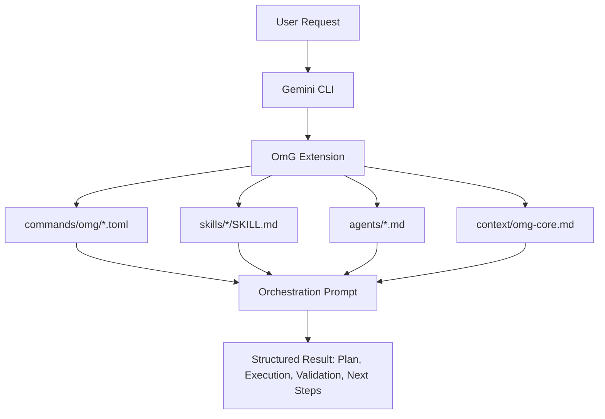
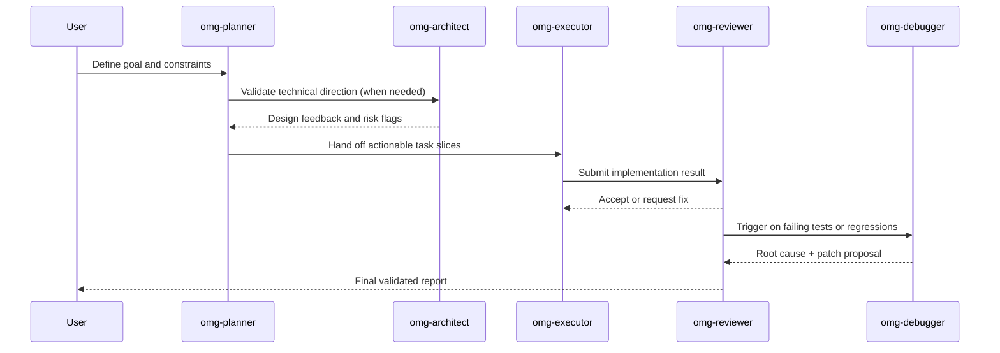

# oh-my-gemini-cli (OmG)

[Página de inicio](https://joonghyun-lee-frieren.github.io/oh-my-gemini-cli/) | [Historial](./history.md)

[한국어](./README_ko.md) | [日本語](./README_ja.md) | [Français](./README_fr.md) | [中文](./README_zh.md) | [Español](./README_es.md)

Paquete de flujo de trabajo multiagente para Gemini CLI, impulsado por context engineering.

> "La ventaja competitiva principal de Claude Code no es Opus ni Sonnet. Es Claude Code en sí. Sorprendentemente, Gemini también funciona muy bien cuando se le conecta ese mismo harness."
>
> - Jeongkyu Shin (CEO de Lablup Inc.), en una entrevista de YouTube

Este proyecto empezó con esta pregunta:
"¿Qué pasaría si llevamos ese modelo de harness a Gemini CLI?"

OmG amplía Gemini CLI, de un asistente de sesión única, a un flujo de ingeniería estructurado y orientado por roles.

## Novedades de v0.3.0

- Se añadió un ciclo de vida de equipo por etapas: `team-plan -> team-prd -> team-exec -> team-verify -> team-fix`
- Se añadieron modos operativos: `balanced`, `speed`, `deep`, `autopilot`, `ralph`, `ultrawork`
- Se añadieron controles de ciclo de vida: `/omg:launch`, `/omg:checkpoint`, `/omg:stop`, `/omg:mode`
- Se añadieron agentes especialistas para alcance de producto, compuertas de verificación y convergencia de decisiones
- Se añadieron nuevas skills de flujo: `$prd`, `$ralplan`, `$autopilot`, `$ralph`, `$ultrawork`, `$consensus`, `$mode`, `$cancel`

## Vista general

| Elemento | Resumen |
| --- | --- |
| Modelo de entrega | Extensión oficial de Gemini CLI (`gemini-extension.json`) |
| Bloques principales | `agents/`, `commands/`, `skills/`, `context/` |
| Caso de uso principal | Tareas complejas que necesitan ciclos de planificar -> ejecutar -> revisar |
| Superficie de control | Comandos `/omg:*` + flujos `$skill` + delegación a sub-agentes |
| Estrategia de modelo por defecto | Planificación/arquitectura en `gemini-3.1-pro`, trabajo intensivo de ejecución en `gemini-3.1-flash` |

## Por qué OmG

| Problema en un flujo crudo de sesión única | Respuesta de OmG |
| --- | --- |
| El contexto se mezcla entre planificación y ejecución | Agentes separados por rol con responsabilidades enfocadas |
| Difícil mantener visibilidad del progreso en tareas largas | Etapas explícitas de workflow y chequeos de estado por comando |
| Ingeniería de prompts repetitiva para tareas comunes | Plantillas reutilizables de skills (`$plan`, `$team`, `$research`) |
| Deriva entre "lo decidido" y "lo que cambió" | Roles de revisión y depuración dentro del mismo bucle de orquestación |

## Arquitectura



## Flujo de equipo



## Instalación

Instala desde GitHub usando el comando oficial de Gemini Extensions:

```bash
gemini extensions install https://github.com/Joonghyun-Lee-Frieren/oh-my-gemini-cli
```

Verifica en modo interactivo:

```text
/extensions list
```

Verifica en modo terminal:

```bash
gemini extensions list
```

Ejecuta una prueba rápida:

```text
/omg:status
```

Nota: los comandos de instalación/actualización de extensiones se ejecutan en modo terminal (`gemini extensions ...`), no en modo interactivo de comandos slash.

## Mapa de interfaces

### Commands

| Comando | Propósito | Momento típico |
| --- | --- | --- |
| `/omg:status` | Resume progreso, riesgos y próximas acciones | Inicio/fin de una sesión de trabajo |
| `/omg:team` | Ejecuta el pipeline completo por etapas (`plan -> prd -> exec -> verify -> fix`) | Entrega de funciones complejas o refactors |
| `/omg:team-plan` | Construye un plan de ejecución con dependencias | Antes de implementar |
| `/omg:team-prd` | Fija criterios de aceptación y restricciones medibles | Después de planificar, antes de codificar |
| `/omg:team-exec` | Implementa un bloque de entrega acotado | Bucle principal de implementación |
| `/omg:team-verify` | Valida criterios de aceptación y regresiones | Después de cada bloque de ejecución |
| `/omg:team-fix` | Corrige solo fallos verificados | Cuando falla la verificación |
| `/omg:mode` | Inspecciona o cambia perfil operativo (`balanced/speed/deep/autopilot/ralph/ultrawork`) | Al iniciar sesión o cambiar de postura |
| `/omg:autopilot` | Ejecuta ciclos autónomos iterativos con checkpoints | Entregas autónomas complejas |
| `/omg:ralph` | Fuerza orquestación estricta con compuertas de calidad | Tareas críticas de release |
| `/omg:ultrawork` | Modo de alto rendimiento para tareas independientes por lotes | Backlogs grandes |
| `/omg:consensus` | Converge a una opción entre varios diseños | Momentos con mucha toma de decisiones |
| `/omg:launch` | Inicializa estado persistente de ciclo de vida para tareas largas | Inicio de sesiones largas |
| `/omg:checkpoint` | Guarda checkpoint compacto y pista para reanudar | Traspasos a mitad de sesión |
| `/omg:stop` | Detiene de forma segura el modo autónomo y preserva progreso | Pausas/interrupciones |
| `/omg:optimize` | Mejora prompts/contexto para calidad y eficiencia de tokens | Después de sesiones ruidosas o costosas |
| `/omg:cache` | Inspecciona caché y comportamiento de contexto | Tareas largas con mucho contexto |

### Skills

| Skill | Enfoque | Estilo de salida |
| --- | --- | --- |
| `$plan` | Convierte objetivos en plan por fases | Hitos, riesgos y criterios de aceptación |
| `$ralplan` | Planificación estricta por etapas con puntos de rollback | Mapa de ejecución con prioridad de calidad |
| `$execute` | Implementa un bloque acotado del plan | Resumen de cambios con notas de validación |
| `$prd` | Convierte solicitudes en criterios de aceptación medibles | Contrato de alcance estilo PRD |
| `$team` | Orquestación completa entre roles | Informe combinado multiagente |
| `$autopilot` | Ejecución autónoma en bucles por etapas | Tablero de ciclos con bloqueos |
| `$ralph` | Orquestación estricta con compuertas de verificación | Tablero de compuertas + decisión de envío |
| `$ultrawork` | Ejecución por lotes de alto rendimiento | Tablero por shards + compuertas periódicas |
| `$consensus` | Comparación de opciones y convergencia | Matriz de decisión + ruta elegida |
| `$mode` | Cambio de modo/perfil | Postura activa + comando siguiente recomendado |
| `$cancel` | Parada segura con handoff para reanudar | Resumen de parada de ciclo de vida |
| `$research` | Explora opciones y tradeoffs | Comparación orientada a decisión |
| `$context-optimize` | Mejora la estructura de contexto | Ajustes de compresión y relación señal/ruido |

### Sub-agents

| Agente | Responsabilidad principal | Perfil de modelo recomendado |
| --- | --- | --- |
| `omg-architect` | Límites del sistema, interfaces, mantenibilidad a largo plazo | `gemini-3.1-pro` |
| `omg-planner` | Descomposición y secuenciación de tareas | `gemini-3.1-pro` |
| `omg-product` | Bloqueo de alcance, no-objetivos y criterios medibles | `gemini-3.1-pro` |
| `omg-executor` | Ciclos rápidos de implementación | `gemini-3.1-flash` |
| `omg-reviewer` | Verificación de corrección y riesgo de regresión | `gemini-3.1-pro` |
| `omg-verifier` | Evidencia de criterios de aceptación y preparación para release | `gemini-3.1-pro` |
| `omg-debugger` | Análisis de causa raíz y estrategia de parche | `gemini-3.1-pro` |
| `omg-consensus` | Puntuación de opciones y convergencia de decisión | `gemini-3.1-pro` |
| `omg-researcher` | Análisis y síntesis de opciones externas | `gemini-3.1-pro` |
| `omg-quick` | Arreglos pequeños y tácticos | `gemini-3.1-flash` |

## Modelo de capas de contexto

| Capa | Fuente | Objetivo |
| --- | --- | --- |
| 1 | Restricciones del sistema/runtime | Mantener el comportamiento alineado con las garantías de la plataforma |
| 2 | Estándares del proyecto | Preservar convenciones de equipo e intención arquitectónica |
| 3 | `GEMINI.md` y contexto compartido | Mantener memoria estable en sesiones largas |
| 4 | Brief activo de la tarea | Mantener visible el objetivo actual y los criterios de aceptación |
| 5 | Trazas de ejecución más recientes | Alimentar iteraciones y bucles de revisión inmediatos |

## Estructura del proyecto

```text
oh-my-gemini-cli/
|- gemini-extension.json
|- agents/
|- commands/
|  `- omg/
|- skills/
|- context/
|- docs/
`- LICENSE
```

## Solución de problemas

| Síntoma | Causa probable | Acción |
| --- | --- | --- |
| `settings.filter is not a function` durante instalación | Runtime de Gemini CLI obsoleto o metadatos de extensión en caché desactualizados | Actualiza Gemini CLI, desinstala la extensión y vuelve a instalar desde la URL del repositorio |
| Comando `/omg:*` no encontrado | La extensión no se cargó en la sesión actual | Ejecuta `gemini extensions list` y reinicia la sesión de Gemini CLI |
| La skill no se dispara | Desajuste de ruta en frontmatter de la skill | Confirma que existe `skills/<name>/SKILL.md` y recarga la extensión |

## Notas de migración

| Flujo legado | Flujo extension-first |
| --- | --- |
| Instalación global del paquete + copia con `omg setup` | `gemini extensions install ...` |
| Runtime conectado principalmente por scripts de CLI | Runtime conectado por primitivas del manifest de extensión |
| Scripts manuales de onboarding | Carga nativa de extensiones por Gemini CLI |


## Documentación

- [Guía de instalación](./guide/installation.md)
- [Guía de context engineering (English)](./guide/context-engineering.md)
- [Guía de context engineering (Korean)](./guide/context-engineering_ko.md)
- [Historial](./history.md)

## Licencia

MIT


