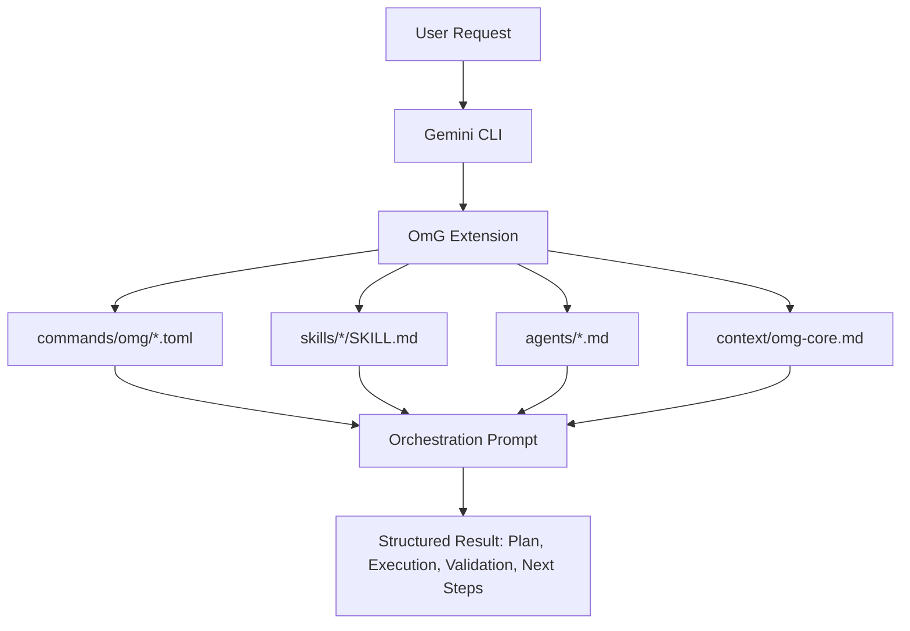
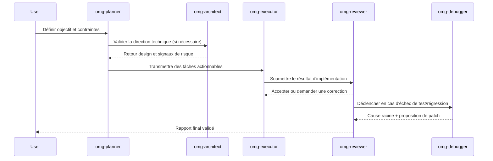

# oh-my-gemini-cli (OmG)

[Page d'accueil](https://joonghyun-lee-frieren.github.io/oh-my-gemini-cli/) | [Historique](./history.md)

[한국어](./README_ko.md) | [日本語](./README_ja.md) | [Français](./README_fr.md) | [中文](./README_zh.md) | [Español](./README_es.md)

Pack de workflow multi-agents piloté par l'ingénierie de contexte pour Gemini CLI.

> "L'avantage compétitif principal de Claude Code n'est ni Opus ni Sonnet. C'est Claude Code lui-même. De façon surprenante, Gemini fonctionne aussi très bien avec ce harnais."
>
> - Jeongkyu Shin (CEO de Lablup Inc.), interview YouTube

Ce projet est né de cette observation :
"Et si on apportait ce modèle de harnais à Gemini CLI ?"

OmG transforme Gemini CLI, d'un assistant mono-session, en workflow d'ingénierie structuré par rôles.

## Nouveautés v0.3.0

- Ajout d'un cycle d'équipe par étapes : `team-plan -> team-prd -> team-exec -> team-verify -> team-fix`
- Ajout de modes d'opération : `balanced`, `speed`, `deep`, `autopilot`, `ralph`, `ultrawork`
- Ajout de contrôles de cycle de vie : `/omg:launch`, `/omg:checkpoint`, `/omg:stop`, `/omg:mode`
- Ajout d'agents spécialisés pour le cadrage produit, les portes de vérification et la convergence de décision
- Ajout de nouvelles skills : `$prd`, `$ralplan`, `$autopilot`, `$ralph`, `$ultrawork`, `$consensus`, `$mode`, `$cancel`

## Vue d'ensemble

| Élément | Résumé |
| --- | --- |
| Modèle de livraison | Extension Gemini CLI officielle (`gemini-extension.json`) |
| Blocs principaux | `agents/`, `commands/`, `skills/`, `context/` |
| Cas d'usage principal | Tâches complexes nécessitant des boucles planifier -> exécuter -> vérifier |
| Surface de contrôle | Commandes `/omg:*` + workflows `$skill` + délégation à des sous-agents |
| Stratégie modèle par défaut | Planification/architecture avec `gemini-3.1-pro`, exécution avec `gemini-3.1-flash` |

## Pourquoi OmG

| Problème en session brute | Réponse OmG |
| --- | --- |
| Le contexte planification/exécution se mélange | Séparation des rôles avec responsabilités ciblées |
| La progression est difficile à suivre en tâche longue | Étapes explicites + commandes de statut |
| Prompt engineering répétitif pour les tâches courantes | Templates de skills réutilisables (`$plan`, `$team`, `$research`) |
| Dérive entre décisions et changements réels | Rôles de revue et de debug intégrés à la même boucle |

## Architecture



## Workflow d'équipe



## Installation

Installer depuis GitHub via la commande officielle Gemini Extensions :

```bash
gemini extensions install https://github.com/Joonghyun-Lee-Frieren/oh-my-gemini-cli
```

Vérifier en mode interactif :

```text
/extensions list
```

Vérifier en mode terminal :

```bash
gemini extensions list
```

Smoke test :

```text
/omg:status
```

Note : les commandes d'installation/mise à jour s'exécutent en mode terminal (`gemini extensions ...`), pas en mode slash interactif.

## Carte des interfaces

### Commands

| Commande | Objectif | Moment typique |
| --- | --- | --- |
| `/omg:status` | Résumer progression, risques et prochaines actions | Début/fin de session |
| `/omg:team` | Exécuter tout le pipeline d'étapes (`plan -> prd -> exec -> verify -> fix`) | Livraison de feature/refactor complexe |
| `/omg:team-plan` | Construire un plan d'exécution avec dépendances | Avant implémentation |
| `/omg:team-prd` | Verrouiller critères d'acceptation mesurables et contraintes | Après planification, avant code |
| `/omg:team-exec` | Implémenter un lot de scope validé | Boucle principale d'implémentation |
| `/omg:team-verify` | Valider critères d'acceptation et régressions | Après chaque lot d'exécution |
| `/omg:team-fix` | Corriger uniquement les échecs vérifiés | En cas d'échec de vérification |
| `/omg:mode` | Consulter/changer le profil d'opération (`balanced/speed/deep/autopilot/ralph/ultrawork`) | Début de session ou changement de posture |
| `/omg:autopilot` | Exécuter des cycles autonomes itératifs avec checkpoints | Livraison autonome complexe |
| `/omg:ralph` | Forcer une orchestration stricte avec portes qualité | Tâches critiques de release |
| `/omg:ultrawork` | Mode haut débit pour lots de tâches indépendantes | Gros backlog |
| `/omg:consensus` | Converger vers une option parmi plusieurs designs | Phases orientées décision |
| `/omg:launch` | Initialiser un état de cycle de vie persistant pour tâches longues | Début de longues sessions |
| `/omg:checkpoint` | Sauvegarder un checkpoint compact avec indice de reprise | Handoff en milieu de session |
| `/omg:stop` | Arrêter proprement le mode autonome en conservant la progression | Pause/interruption |
| `/omg:optimize` | Optimiser prompts/contexte pour qualité et coût token | Après une session coûteuse/bruyante |
| `/omg:cache` | Auditer le comportement cache/contexte | Tâches à contexte long |

### Skills

| Skill | Focus | Style de sortie |
| --- | --- | --- |
| `$plan` | Transformer les objectifs en plan par phases | Jalons, risques, critères d'acceptation |
| `$ralplan` | Planification stricte par étapes avec points de rollback | Carte d'exécution orientée qualité |
| `$execute` | Implémenter un lot de plan cadré | Résumé de changements + notes de validation |
| `$prd` | Convertir une demande en critères d'acceptation mesurables | Contrat de scope style PRD |
| `$team` | Orchestration complète multi-rôles | Rapport multi-agent fusionné |
| `$autopilot` | Exécution autonome en boucle d'étapes | Tableau de cycles + bloqueurs |
| `$ralph` | Orchestration stricte avec vérification obligatoire | Tableau de gates + décision de livraison |
| `$ultrawork` | Exécution batch haut débit | Tableau de shards + gates périodiques |
| `$consensus` | Comparer les options et converger | Matrice de décision + option retenue |
| `$mode` | Changer le mode/profil | Posture active + commande suivante recommandée |
| `$cancel` | Arrêt propre avec handoff de reprise | Résumé d'arrêt du cycle de vie |
| `$research` | Explorer options/compromis | Comparaison orientée décision |
| `$context-optimize` | Optimiser la structure de contexte | Compression + meilleur signal/bruit |

### Sub-agents

| Agent | Responsabilité principale | Profil modèle recommandé |
| --- | --- | --- |
| `omg-architect` | Frontières système, interfaces, maintenabilité long terme | `gemini-3.1-pro` |
| `omg-planner` | Découpage des tâches et dépendances | `gemini-3.1-pro` |
| `omg-product` | Verrouillage scope/non-scope et critères mesurables | `gemini-3.1-pro` |
| `omg-executor` | Cycles d'implémentation rapides | `gemini-3.1-flash` |
| `omg-reviewer` | Vérification de justesse et risques de régression | `gemini-3.1-pro` |
| `omg-verifier` | Vérification des preuves d'acceptation et readiness release | `gemini-3.1-pro` |
| `omg-debugger` | Analyse cause racine et stratégie de patch | `gemini-3.1-pro` |
| `omg-consensus` | Scoring d'options et convergence de décision | `gemini-3.1-pro` |
| `omg-researcher` | Analyse et synthèse d'options externes | `gemini-3.1-pro` |
| `omg-quick` | Petites corrections tactiques | `gemini-3.1-flash` |

## Modèle de couches de contexte

| Couche | Source | Objectif |
| --- | --- | --- |
| 1 | Contraintes système/runtime | Aligner le comportement sur les garanties plateforme |
| 2 | Standards projet | Préserver conventions d'équipe et intention d'architecture |
| 3 | `GEMINI.md` et contexte partagé | Maintenir une mémoire stable en longue session |
| 4 | Brief de tâche active | Garder objectif courant et critères d'acceptation visibles |
| 5 | Traces d'exécution récentes | Alimenter les boucles d'itération et de vérification |

## Structure du projet

```text
oh-my-gemini-cli/
|- gemini-extension.json
|- agents/
|- commands/
|  `- omg/
|- skills/
|- context/
|- docs/
`- LICENSE
```

## Dépannage

| Symptôme | Cause probable | Action |
| --- | --- | --- |
| `settings.filter is not a function` pendant l'installation | Runtime Gemini CLI obsolète ou cache extension périmé | Mettre à jour Gemini CLI, désinstaller puis réinstaller l'extension |
| `/omg:*` introuvable | Extension non chargée dans la session actuelle | Exécuter `gemini extensions list`, puis redémarrer la session CLI |
| Une skill ne se déclenche pas | Mismatch frontmatter/path de skill | Vérifier `skills/<name>/SKILL.md` et recharger l'extension |

## Notes de migration

| Ancien flux | Flux extensions-first |
| --- | --- |
| Package global + copie via `omg setup` | `gemini extensions install ...` |
| Runtime principalement câblé par scripts CLI | Runtime câblé par primitives de manifeste d'extension |
| Scripts d'onboarding manuels | Chargement natif des extensions Gemini CLI |


## Documentation

- [Guide d'installation](./guide/installation.md)
- [Guide Context Engineering](./guide/context-engineering.md)
- [Guide Context Engineering coréen](./guide/context-engineering_ko.md)
- [Historique](./history.md)

## Licence

MIT


