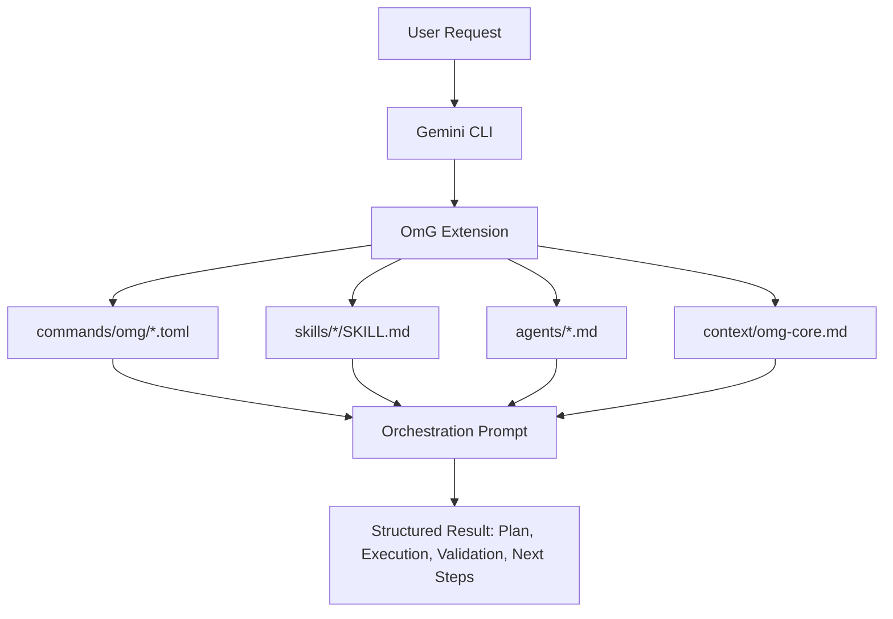
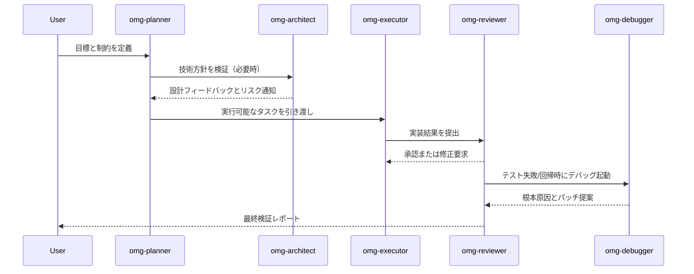

# oh-my-gemini-cli (OmG)

[ランディングページ](https://joonghyun-lee-frieren.github.io/oh-my-gemini-cli/) | [変更履歴](./history.md)

[한국어](./README_ko.md) | [日本語](./README_ja.md) | [Français](./README_fr.md) | [中文](./README_zh.md) | [Español](./README_es.md)

Gemini CLI 向けの、コンテキストエンジニアリング駆動マルチエージェント・ワークフローパックです。

> "Claude Code の本当の競争力は Opus や Sonnet ではなく、Claude Code そのものだ。Gemini でも同じハーネスを付けると十分にうまく動く。"
>
> - シン・ジョンギュ（Lablup Inc. CEO）、YouTube インタビューより

このプロジェクトは次の着想から始まりました:
"このハーネスモデルを Gemini CLI に持ってきたらどうなるか？"

OmG は Gemini CLI を単発セッションのアシスタントから、構造化された役割分担型エンジニアリングワークフローへ拡張します。

## v0.3.0 の新機能

- ステージ型チームライフサイクルを追加: `team-plan -> team-prd -> team-exec -> team-verify -> team-fix`
- 運用モードを追加: `balanced`, `speed`, `deep`, `autopilot`, `ralph`, `ultrawork`
- ライフサイクル制御を追加: `/omg:launch`, `/omg:checkpoint`, `/omg:stop`, `/omg:mode`
- プロダクトスコープ、検証ゲート、意思決定収束の専門エージェントを追加
- 新しいワークフロースキルを追加: `$prd`, `$ralplan`, `$autopilot`, `$ralph`, `$ultrawork`, `$consensus`, `$mode`, `$cancel`

## 概要

| 項目 | 概要 |
| --- | --- |
| 提供モデル | 公式 Gemini CLI 拡張 (`gemini-extension.json`) |
| コア構成 | `agents/`, `commands/`, `skills/`, `context/` |
| 主な利用ケース | 計画 -> 実装 -> 検証ループが必要な複雑実装 |
| 操作面 | `/omg:*` コマンド + `$skill` ワークフロー + サブエージェント委譲 |
| 既定のモデル戦略 | 計画/設計は `gemini-3.1-pro`、実装中心は `gemini-3.1-flash` |

## なぜ OmG か

| 単一セッションの課題 | OmG の対応 |
| --- | --- |
| 計画と実装の文脈が混ざる | 役割分離エージェントで責務を明確化 |
| 長期タスクで進捗可視性が低い | 明示的なステージ運用とステータス確認 |
| 共通作業で毎回プロンプト調整が必要 | 再利用可能なスキルテンプレート (`$plan`, `$team`, `$research`) |
| 意思決定と変更内容が乖離しやすい | 同一オーケストレーション内にレビュー/デバッグを組み込み |

## アーキテクチャ



## チームワークフロー



## インストール

公式 Gemini Extensions コマンドで GitHub からインストール:

```bash
gemini extensions install https://github.com/Joonghyun-Lee-Frieren/oh-my-gemini-cli
```

対話モードで確認:

```text
/extensions list
```

ターミナルモードで確認:

```bash
gemini extensions list
```

スモークテスト:

```text
/omg:status
```

注意: インストール/更新コマンドは対話スラッシュモードではなく、ターミナルモード（`gemini extensions ...`）で実行します。

## インターフェースマップ

### Commands

| コマンド | 目的 | 典型タイミング |
| --- | --- | --- |
| `/omg:status` | 進捗・リスク・次アクションを要約 | セッション開始/終了 |
| `/omg:team` | 全ステージパイプラインを実行 (`plan -> prd -> exec -> verify -> fix`) | 複雑な機能実装/リファクタ |
| `/omg:team-plan` | 依存関係を考慮した実行計画を作成 | 実装前 |
| `/omg:team-prd` | 測定可能な受け入れ基準と制約を固定 | 計画後、実装前 |
| `/omg:team-exec` | スコープ済みの実装スライスを実行 | メイン実装ループ |
| `/omg:team-verify` | 受け入れ基準と回帰を検証 | 各実装スライス後 |
| `/omg:team-fix` | 検証で確認された失敗のみ修正 | 検証失敗時 |
| `/omg:mode` | 運用プロファイルの確認/切替 (`balanced/speed/deep/autopilot/ralph/ultrawork`) | セッション開始時・方針変更時 |
| `/omg:autopilot` | チェックポイント付き反復自動サイクルを実行 | 自律実行が必要な複雑タスク |
| `/omg:ralph` | 厳格な品質ゲートオーケストレーションを強制 | リリース重要タスク |
| `/omg:ultrawork` | 独立タスクの高スループットバッチモード | 大規模バックログ |
| `/omg:consensus` | 複数設計オプションを1つに収束 | 意思決定重視フェーズ |
| `/omg:launch` | 長期タスク向けに永続ライフサイクル状態を初期化 | 長期セッション開始時 |
| `/omg:checkpoint` | 再開ヒント付きコンパクトチェックポイント保存 | セッション中間ハンドオフ |
| `/omg:stop` | 自律モードを安全停止し進捗を保持 | 一時停止/割り込み時 |
| `/omg:optimize` | 品質/トークン効率向上のため文脈とプロンプトを最適化 | セッションが重くなった後 |
| `/omg:cache` | キャッシュ/文脈挙動を監査 | 長期文脈タスク |

### Skills

| スキル | 焦点 | 出力スタイル |
| --- | --- | --- |
| `$plan` | 目標を段階計画へ変換 | マイルストーン、リスク、受け入れ基準 |
| `$ralplan` | ロールバック点付き厳格ステージ計画 | 品質優先実行マップ |
| `$execute` | スコープ済み計画スライスの実装 | 変更要約 + 検証ノート |
| `$prd` | リクエストを測定可能な受け入れ基準へ変換 | PRD形式のスコープ契約 |
| `$team` | 役割横断のフルオーケストレーション | 統合マルチエージェントレポート |
| `$autopilot` | ステージループ型自律実行 | サイクルボード + ブロッカー |
| `$ralph` | 厳格な検証ゲートオーケストレーション | ゲートボード + 出荷判断 |
| `$ultrawork` | バッチ高スループット実行 | シャードボード + 定期ゲート |
| `$consensus` | オプション比較と収束 | 意思決定マトリクス + 採用案 |
| `$mode` | モード/プロファイル切替 | 現在の運用姿勢 + 次コマンド |
| `$cancel` | 再開可能な引き継ぎ付き安全停止 | ライフサイクル停止サマリ |
| `$research` | 選択肢/トレードオフ調査 | 意思決定向け比較 |
| `$context-optimize` | 文脈構造最適化 | 圧縮 + S/N 比改善 |

### Sub-agents

| エージェント | 主責務 | 推奨モデルプロファイル |
| --- | --- | --- |
| `omg-architect` | システム境界、インターフェース、長期保守性 | `gemini-3.1-pro` |
| `omg-planner` | タスク分解と依存関係/順序設計 | `gemini-3.1-pro` |
| `omg-product` | スコープ/非スコープと測定可能な受け入れ基準固定 | `gemini-3.1-pro` |
| `omg-executor` | 高速実装サイクル | `gemini-3.1-flash` |
| `omg-reviewer` | 正しさと回帰リスク確認 | `gemini-3.1-pro` |
| `omg-verifier` | 受け入れ根拠の検証とリリース準備度判定 | `gemini-3.1-pro` |
| `omg-debugger` | 根本原因分析と修正戦略 | `gemini-3.1-pro` |
| `omg-consensus` | オプションスコアリングと意思決定収束 | `gemini-3.1-pro` |
| `omg-researcher` | 外部選択肢の分析と統合 | `gemini-3.1-pro` |
| `omg-quick` | 小規模な戦術的修正 | `gemini-3.1-flash` |

## コンテキストレイヤーモデル

| レイヤー | ソース | 目的 |
| --- | --- | --- |
| 1 | システム / ランタイム制約 | プラットフォーム保証と動作整合 |
| 2 | プロジェクト標準 | チーム規約と設計意図を維持 |
| 3 | `GEMINI.md` と共有コンテキスト | 長期セッションメモリの安定化 |
| 4 | アクティブタスクブリーフ | 現在目標と受け入れ基準を可視化 |
| 5 | 最新実行トレース | 直近の反復・検証ループを支援 |

## プロジェクト構成

```text
oh-my-gemini-cli/
|- gemini-extension.json
|- agents/
|- commands/
|  `- omg/
|- skills/
|- context/
|- prompts/
|- docs/
`- LICENSE
```

## トラブルシューティング

| 症状 | 主な原因 | 対応 |
| --- | --- | --- |
| インストール中 `settings.filter is not a function` | Gemini CLI ランタイムまたは拡張メタデータキャッシュが古い | Gemini CLI 更新後、拡張を削除して再インストール |
| `/omg:*` が見つからない | 現在セッションで拡張がロードされていない | `gemini extensions list` 実行後に CLI セッション再起動 |
| スキルが起動しない | スキル frontmatter/path の不一致 | `skills/<name>/SKILL.md` 存在確認と拡張リロード |

## 移行メモ

| 旧フロー | Extensions-first フロー |
| --- | --- |
| グローバルパッケージ + `omg setup` コピー | `gemini extensions install ...` |
| CLI スクリプト中心のランタイム配線 | 拡張マニフェスト中心のランタイム配線 |
| 手動オンボーディングスクリプト | Gemini CLI のネイティブ拡張ローディング |

`src/` のレガシーランタイムコードは互換性参照として残っていますが、拡張挙動はマニフェスト駆動です。

## ドキュメント

- [インストールガイド](./guide/installation.md)
- [Context Engineering Guide](./guide/context-engineering.md)
- [Korean Context Engineering Guide](./guide/context-engineering_ko.md)
- [変更履歴](./history.md)

## ライセンス

MIT
