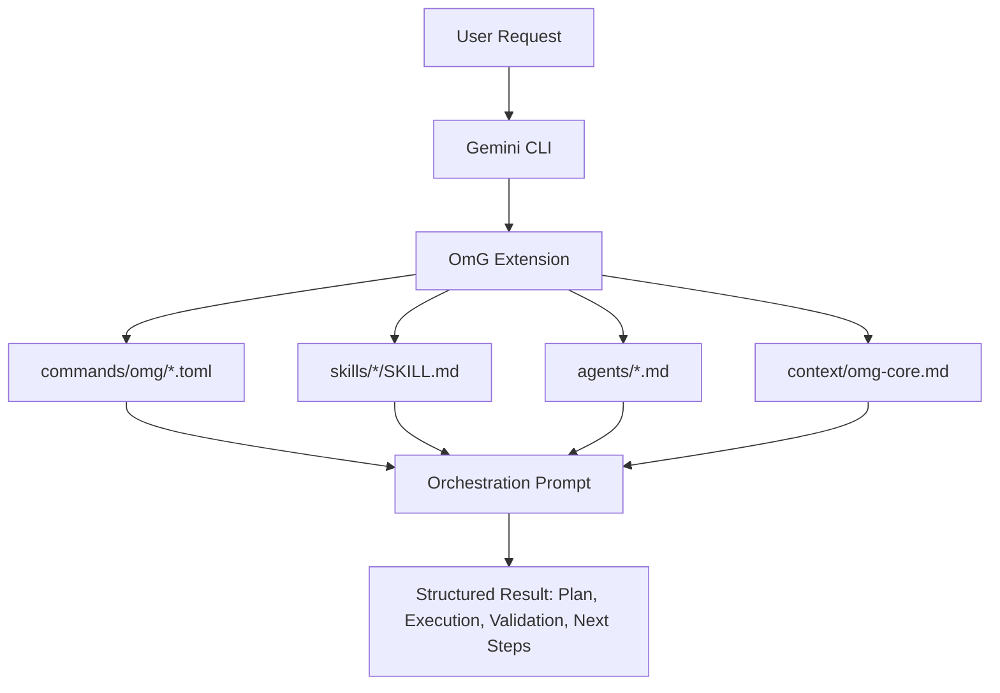
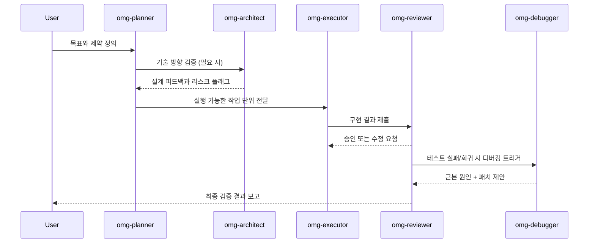

# oh-my-gemini-cli (OmG)

[랜딩 페이지](https://joonghyun-lee-frieren.github.io/oh-my-gemini-cli/) | [변경 이력](./history.md)

[한국어](./README_ko.md) | [日本語](./README_ja.md) | [Français](./README_fr.md) | [中文](./README_zh.md) | [Español](./README_es.md)

Gemini CLI를 위한 컨텍스트 엔지니어링 기반 멀티 에이전트 워크플로우 팩입니다.

> "Claude Code의 핵심 경쟁력은 Opus나 Sonnet 엔진이 아닙니다. Claude Code 그 자체에요. 놀랍지만 Gemini도 Claude Code를 붙이면 잘 돌아갑니다."
>
> - 신정규 (Lablup Inc. CEO), 유튜브 채널 인터뷰 중

이 프로젝트는 이 관찰에서 시작했습니다:
"그 하네스 모델을 Gemini CLI로 가져오면 어떨까?"

OmG는 Gemini CLI를 단일 세션 도우미에서 구조화된 역할 기반 엔지니어링 워크플로우로 확장합니다.

## v0.3.2의 새로운 내용

- 확장 네이티브 시각 상태 렌더링을 위한 HUD 프로파일 제어 추가:
  - `/omg:hud`
  - `/omg:hud-on`
  - `/omg:hud-compact`
  - `/omg:hud-off`
  - `$hud`
- `/omg:status` 출력에 HUD 가시성 프로파일(`normal`, `compact`, `hidden`) 반영
- HUD 런타임 상태 규약 추가: `.omg/state/hud.json`
- Gemini Extensions 경계 명확화: 시각 요약은 프롬프트/상태 기반으로 가능하며, 터미널 statusline hook 주입은 런타임 구현이 필요
- 로컬 대시보드 HUD 개선: 상단 HUD 라인 추가, `h` 키 토글(`normal -> compact -> hidden`) 및 `.omg/state/hud.json` 동기화

## v0.3.1의 새로운 내용

- 인텐트 기반 인테이크 게이트 추가: `/omg:intent` + `$intent`
- 미해결 항목용 루프 강제 제어 추가: `/omg:loop` + `$loop`
- 장기 세션 시작용 딥 초기화 추가: `/omg:deep-init` + `$deep-init`
- 작업 조건 기반 룰 인젝션 추가: `/omg:rules` + `$rules`
- 확장 네이티브 범위 명확화: `commands/skills/context` 기반 오케스트레이션은 바로 적용 가능, 런타임 훅/백그라운드 워커는 별도 런타임 구현 필요

## v0.3.0의 새로운 내용

- 스테이지 기반 팀 라이프사이클 추가: `team-plan -> team-prd -> team-exec -> team-verify -> team-fix`
- 운영 모드 추가: `balanced`, `speed`, `deep`, `autopilot`, `ralph`, `ultrawork`
- 라이프사이클 제어 추가: `/omg:launch`, `/omg:checkpoint`, `/omg:stop`, `/omg:mode`
- 제품 스코프/검증 게이트/의사결정 수렴용 전문 에이전트 추가
- 신규 워크플로우 스킬 추가: `$prd`, `$ralplan`, `$autopilot`, `$ralph`, `$ultrawork`, `$consensus`, `$mode`, `$cancel`

## 한눈에 보기

| 항목 | 요약 |
| --- | --- |
| 제공 방식 | 공식 Gemini CLI 확장 (`gemini-extension.json`) |
| 핵심 구성 요소 | `agents/`, `commands/`, `skills/`, `context/` |
| 주요 사용 사례 | 계획 -> 실행 -> 검증 루프가 필요한 복잡한 구현 작업 |
| 제어 인터페이스 | `/omg:*` 명령 + `$skill` 워크플로우 + 서브 에이전트 위임 |
| 기본 모델 전략 | 계획/아키텍처는 `gemini-3.1-pro`, 실행 중심 작업은 `gemini-3.1-flash` |

## 왜 OmG인가

| 단일 세션 흐름의 문제 | OmG의 대응 |
| --- | --- |
| 계획과 실행 컨텍스트가 섞임 | 역할 분리 에이전트로 책임 분리 |
| 장기 작업에서 진행 가시성 부족 | 명시적 워크플로우 스테이지 + 상태 명령 |
| 반복적인 프롬프트 엔지니어링 필요 | 재사용 가능한 스킬 템플릿 (`$plan`, `$team`, `$research`) |
| 결정 사항과 변경 사항의 드리프트 | 동일 오케스트레이션 루프 내 리뷰/디버깅 역할 포함 |

## 아키텍처



## 팀 워크플로우



## 설치

공식 Gemini Extensions 명령으로 GitHub에서 설치합니다:

```bash
gemini extensions install https://github.com/Joonghyun-Lee-Frieren/oh-my-gemini-cli
```

대화형 모드 확인:

```text
/extensions list
```

터미널 모드 확인:

```bash
gemini extensions list
```

스모크 테스트:

```text
/omg:status
```

참고: 설치/업데이트 명령은 대화형 슬래시 명령 모드가 아니라 터미널 모드(`gemini extensions ...`)에서 실행합니다.

## 인터페이스 맵

### Commands

| 명령 | 목적 | 사용 시점 |
| --- | --- | --- |
| `/omg:status` | 진행 상황, 리스크, 다음 액션 요약 | 세션 시작/종료 |
| `/omg:hud` | 시각 HUD 프로파일 조회/전환 (`normal`, `compact`, `hidden`) | 장기 세션 시작 전 또는 터미널 밀도 변경 시 |
| `/omg:hud-on` | HUD를 전체 시각 모드로 빠르게 전환 | 전체 상태 보드로 복귀할 때 |
| `/omg:hud-compact` | HUD를 컴팩트 모드로 빠르게 전환 | 구현 루프 중 밀도 높은 업데이트가 필요할 때 |
| `/omg:hud-off` | HUD를 숨김 모드로 빠르게 전환 (플레인 상태 섹션) | 시각 블록이 방해될 때 |
| `/omg:intent` | 요청 인텐트를 분류하고 적절한 스테이지/명령으로 라우팅 | 계획/구현 전, 요청 의도가 모호할 때 |
| `/omg:rules` | 작업 조건에 맞는 가드레일 룰 팩 활성화 | 마이그레이션/보안/성능 민감 작업 시작 전 |
| `/omg:deep-init` | 장기 세션을 위한 프로젝트 맵/검증 기준선 초기화 | 신규 코드베이스 온보딩 또는 대형 작업 킥오프 시 |
| `/omg:team` | 전체 스테이지 파이프라인 실행 (`plan -> prd -> exec -> verify -> fix`) | 복잡한 기능/리팩터링 전달 |
| `/omg:team-plan` | 의존성을 반영한 실행 계획 수립 | 구현 전 |
| `/omg:team-prd` | 측정 가능한 수용 기준과 제약 고정 | 계획 후, 코딩 전 |
| `/omg:team-exec` | 범위가 고정된 구현 슬라이스 수행 | 메인 구현 루프 |
| `/omg:team-verify` | 수용 기준과 회귀 검증 | 각 실행 슬라이스 이후 |
| `/omg:team-fix` | 검증으로 확인된 실패만 패치 | 검증 실패 시 |
| `/omg:loop` | `exec -> verify -> fix` 반복을 done/blocker까지 강제 | 미해결 이슈가 남은 중/후반 구현 단계 |
| `/omg:mode` | 운영 프로파일 조회/전환 (`balanced/speed/deep/autopilot/ralph/ultrawork`) | 세션 시작 또는 운영 방식 전환 시 |
| `/omg:autopilot` | 체크포인트 기반 반복 자동 사이클 실행 | 자율 실행이 필요한 복잡 작업 |
| `/omg:ralph` | 엄격한 품질 게이트 오케스트레이션 강제 | 릴리스 크리티컬 작업 |
| `/omg:ultrawork` | 독립 작업 배치 처리 중심 고처리량 모드 | 대규모 백로그 |
| `/omg:consensus` | 복수 설계 옵션을 하나로 수렴 | 의사결정 중심 구간 |
| `/omg:launch` | 장기 작업을 위한 영속 라이프사이클 상태 초기화 | 장기 세션 시작 시 |
| `/omg:checkpoint` | 재개 힌트가 포함된 컴팩트 체크포인트 저장 | 세션 중간 핸드오프 |
| `/omg:stop` | 자율 모드를 안전 중지하고 진행 상태 보존 | 일시 중지/인터럽트 시 |
| `/omg:optimize` | 품질/토큰 효율을 위한 프롬프트/컨텍스트 개선 | 세션이 복잡하거나 비용이 커진 뒤 |
| `/omg:cache` | 캐시와 컨텍스트 동작 점검 | 장기 컨텍스트 작업 |

### Skills

| 스킬 | 초점 | 출력 스타일 |
| --- | --- | --- |
| `$deep-init` | 딥 리포지토리 맵/검증 기준선 초기화 | 구조/리스크 맵 + 온보딩 핸드오프 |
| `$hud` | 상태 출력용 시각 HUD 프로파일 관리 | HUD 프로파일 + 프리뷰 라인 |
| `$intent` | 모호한 요청을 올바른 OmG 단계로 라우팅 | 인텐트 분류 + 다음 명령 추천 |
| `$rules` | 조건부 가드레일 룰 팩 주입 | 트리거 매트릭스 + 활성 정책 |
| `$plan` | 목표를 단계별 계획으로 변환 | 마일스톤, 리스크, 수용 기준 |
| `$ralplan` | 롤백 지점을 포함한 엄격한 스테이지 게이팅 계획 | 품질 우선 실행 맵 |
| `$execute` | 범위가 고정된 계획 슬라이스 구현 | 변경 요약 + 검증 노트 |
| `$prd` | 요청을 측정 가능한 수용 기준으로 변환 | PRD 스타일 범위 계약 |
| `$team` | 역할 기반 전체 오케스트레이션 | 통합 멀티 에이전트 리포트 |
| `$loop` | 해결될 때까지 exec/verify/fix 반복 강제 | 사이클 상태 보드 + 잔여 백로그 |
| `$autopilot` | 스테이지 루프 기반 자율 실행 | 사이클 보드 + 블로커 |
| `$ralph` | 엄격한 검증 게이트 오케스트레이션 | 게이트 보드 + 출하 결정 |
| `$ultrawork` | 배치 고처리량 실행 | 샤드 보드 + 주기적 게이트 |
| `$consensus` | 옵션 비교 및 의사결정 수렴 | 의사결정 매트릭스 + 선택 경로 |
| `$mode` | 모드/프로파일 전환 | 현재 포스처 + 권장 다음 명령 |
| `$cancel` | 재개 가능한 핸드오프와 함께 안전 중지 | 라이프사이클 중지 요약 |
| `$research` | 옵션/트레이드오프 탐색 | 의사결정 중심 비교 |
| `$context-optimize` | 컨텍스트 구조 개선 | 압축 + 신호 대 잡음 최적화 |

### Sub-agents

| 에이전트 | 주 책임 | 권장 모델 프로파일 |
| --- | --- | --- |
| `omg-architect` | 시스템 경계, 인터페이스, 장기 유지보수성 | `gemini-3.1-pro` |
| `omg-planner` | 작업 분해와 순서/의존성 관리 | `gemini-3.1-pro` |
| `omg-product` | 범위/비범위와 측정 가능한 수용 기준 고정 | `gemini-3.1-pro` |
| `omg-executor` | 빠른 구현 사이클 | `gemini-3.1-flash` |
| `omg-reviewer` | 정확성/회귀 리스크 점검 | `gemini-3.1-pro` |
| `omg-verifier` | 수용 기준 근거 검증과 릴리스 준비도 판단 | `gemini-3.1-pro` |
| `omg-debugger` | 근본 원인 분석과 패치 전략 | `gemini-3.1-pro` |
| `omg-consensus` | 옵션 스코어링과 의사결정 수렴 | `gemini-3.1-pro` |
| `omg-researcher` | 외부 옵션 분석과 종합 | `gemini-3.1-pro` |
| `omg-quick` | 작은 전술적 수정 | `gemini-3.1-flash` |

## 컨텍스트 레이어 모델

| 레이어 | 소스 | 목표 |
| --- | --- | --- |
| 1 | 시스템 / 런타임 제약 | 플랫폼 보장사항과 동작 정렬 |
| 2 | 프로젝트 표준 | 팀 컨벤션과 아키텍처 의도 유지 |
| 3 | `GEMINI.md` 및 공유 컨텍스트 | 장기 세션 메모리 안정성 유지 |
| 4 | 현재 작업 브리프 | 현재 목표와 수용 기준 가시화 |
| 5 | 최신 실행 트레이스 | 즉각적인 반복/검증 루프 지원 |

## 프로젝트 구조

```text
oh-my-gemini-cli/
|- gemini-extension.json
|- agents/
|- commands/
|  `- omg/
|- skills/
|- context/
|- docs/
`- LICENSE
```

## 문제 해결

| 증상 | 가능 원인 | 조치 |
| --- | --- | --- |
| 설치 중 `settings.filter is not a function` | Gemini CLI 런타임 또는 확장 메타데이터 캐시가 오래됨 | Gemini CLI 업데이트 후 확장 제거/재설치 |
| `/omg:*` 명령을 찾을 수 없음 | 현재 세션에 확장이 로드되지 않음 | `gemini extensions list` 실행 후 CLI 세션 재시작 |
| 스킬이 트리거되지 않음 | 스킬 frontmatter/path 불일치 | `skills/<name>/SKILL.md` 존재 확인 및 확장 재로드 |

## 마이그레이션 노트

| 기존 흐름 | Extensions-First 흐름 |
| --- | --- |
| 전역 패키지 설치 + `omg setup` 복사 프로세스 | `gemini extensions install ...` |
| CLI 스크립트 중심 런타임 연결 | 확장 매니페스트 중심 런타임 연결 |
| 수동 온보딩 스크립트 | Gemini CLI의 네이티브 확장 로딩 |


## 문서

- [설치 가이드](./guide/installation.md)
- [컨텍스트 엔지니어링 가이드](./guide/context-engineering.md)
- [한국어 컨텍스트 엔지니어링 가이드](./guide/context-engineering_ko.md)
- [변경 이력](./history.md)

## 라이선스

MIT


