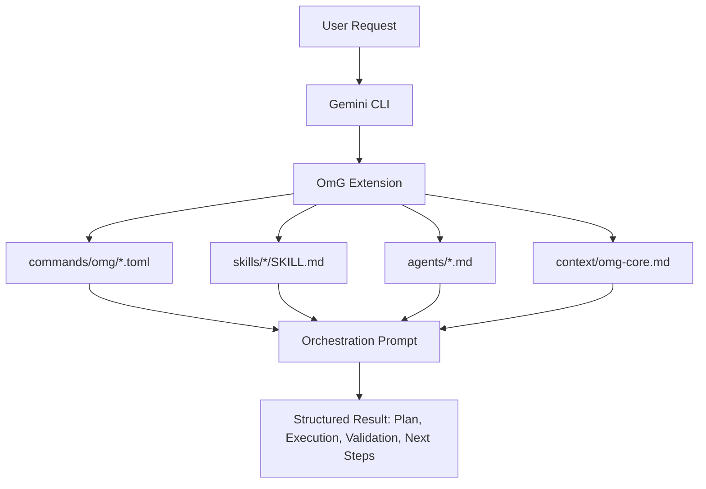
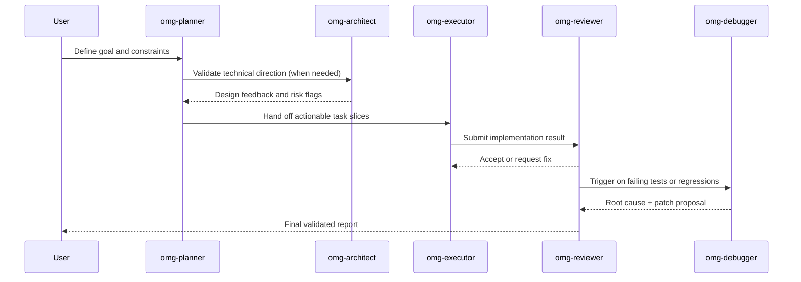

# oh-my-gemini-cli (OmG)

[落地页](https://joonghyun-lee-frieren.github.io/oh-my-gemini-cli/) | [历史记录](./history.md)

[한국어](./README_ko.md) | [日本語](./README_ja.md) | [Français](./README_fr.md) | [中文](./README_zh.md) | [Español](./README_es.md)

面向 Gemini CLI 的、由上下文工程驱动的多智能体工作流套件。

> "Claude Code 的核心竞争力不是 Opus 或 Sonnet 引擎，而是 Claude Code 本身。令人意外的是，把同样的 harness 接到 Gemini 上也很好用。"
>
> - Jeongkyu Shin（Lablup Inc. CEO），来自 YouTube 访谈

本项目由这个问题开始：
"如果我们把这种 harness 模型带到 Gemini CLI，会怎样？"

OmG 将 Gemini CLI 从单会话助手扩展为结构化、角色驱动的工程工作流。

## v0.3.0 新增内容

- 新增阶段化团队生命周期：`team-plan -> team-prd -> team-exec -> team-verify -> team-fix`
- 新增运行模式：`balanced`、`speed`、`deep`、`autopilot`、`ralph`、`ultrawork`
- 新增生命周期控制：`/omg:launch`、`/omg:checkpoint`、`/omg:stop`、`/omg:mode`
- 新增用于产品范围定义、验证关卡和决策收敛的专家智能体
- 新增工作流技能：`$prd`、`$ralplan`、`$autopilot`、`$ralph`、`$ultrawork`、`$consensus`、`$mode`、`$cancel`

## 概览

| 项目 | 摘要 |
| --- | --- |
| 交付模式 | 官方 Gemini CLI 扩展（`gemini-extension.json`） |
| 核心构建块 | `agents/`、`commands/`、`skills/`、`context/` |
| 主要适用场景 | 需要“规划 -> 执行 -> 评审”循环的复杂实现任务 |
| 控制界面 | `/omg:*` 命令 + `$skill` 工作流 + 子智能体委派 |
| 默认模型策略 | 规划/架构使用 `gemini-3.1-pro`，执行密集型工作使用 `gemini-3.1-flash` |

## 为什么选择 OmG

| 原始单会话流程中的问题 | OmG 的应对方式 |
| --- | --- |
| 规划与执行的上下文容易混在一起 | 采用角色分离的智能体，各自职责清晰 |
| 长任务中难以掌握进展 | 明确的工作流阶段与命令驱动的状态检查 |
| 常见任务需要反复手写提示词 | 可复用技能模板（`$plan`、`$team`、`$research`） |
| “已决策内容”与“实际改动”容易漂移 | 在同一编排循环中内置评审与调试角色 |

## 架构



## 团队工作流



## 安装

使用官方 Gemini Extensions 命令从 GitHub 安装：

```bash
gemini extensions install https://github.com/Joonghyun-Lee-Frieren/oh-my-gemini-cli
```

在交互模式中验证：

```text
/extensions list
```

在终端模式中验证：

```bash
gemini extensions list
```

运行一次冒烟测试：

```text
/omg:status
```

说明：扩展安装/更新命令应在终端模式下运行（`gemini extensions ...`），而不是交互式斜杠命令模式。

## 接口地图

### Commands

| 命令 | 作用 | 常用时机 |
| --- | --- | --- |
| `/omg:status` | 汇总进度、风险和下一步行动 | 工作会话开始/结束 |
| `/omg:team` | 执行完整阶段流水线（`plan -> prd -> exec -> verify -> fix`） | 复杂功能或重构交付 |
| `/omg:team-plan` | 生成考虑依赖关系的执行计划 | 实现之前 |
| `/omg:team-prd` | 固化可度量的验收标准与约束 | 规划后、编码前 |
| `/omg:team-exec` | 实现一个范围明确的交付切片 | 主实现循环 |
| `/omg:team-verify` | 校验验收标准与回归风险 | 每个执行切片之后 |
| `/omg:team-fix` | 仅修复已验证的失败项 | 验证失败时 |
| `/omg:mode` | 查看或切换运行配置（`balanced/speed/deep/autopilot/ralph/ultrawork`） | 会话开始或姿态切换时 |
| `/omg:autopilot` | 带检查点的迭代式自治循环 | 复杂自治交付 |
| `/omg:ralph` | 启用严格质量关卡的编排流程 | 发布关键任务 |
| `/omg:ultrawork` | 面向批量独立任务的高吞吐模式 | 大规模待办处理 |
| `/omg:consensus` | 从多个方案中收敛到一个选择 | 决策密集场景 |
| `/omg:launch` | 为长任务初始化持久生命周期状态 | 长会话开始 |
| `/omg:checkpoint` | 保存精简检查点与恢复提示 | 会话中途交接 |
| `/omg:stop` | 平滑停止自治模式并保留进度 | 暂停/中断时 |
| `/omg:optimize` | 优化提示词/上下文以提升质量和 token 效率 | 会话嘈杂或成本偏高后 |
| `/omg:cache` | 查看缓存与上下文行为 | 长时间、上下文密集任务 |

### Skills

| 技能 | 关注点 | 输出风格 |
| --- | --- | --- |
| `$plan` | 将目标转为分阶段计划 | 里程碑、风险与验收标准 |
| `$ralplan` | 带回滚点的严格阶段闸门规划 | 质量优先执行图 |
| `$execute` | 实现一个已规划的范围切片 | 变更摘要 + 验证说明 |
| `$prd` | 将需求转成可度量验收标准 | PRD 风格范围契约 |
| `$team` | 跨角色完整编排 | 综合多智能体报告 |
| `$autopilot` | 自治阶段循环执行 | 循环看板 + 阻塞项 |
| `$ralph` | 严格验证闸门编排 | 闸门看板 + 发布决策 |
| `$ultrawork` | 批量高吞吐执行 | 分片看板 + 周期性闸门 |
| `$consensus` | 方案比较与收敛 | 决策矩阵 + 选定路径 |
| `$mode` | 模式/配置切换 | 当前姿态 + 推荐下一条命令 |
| `$cancel` | 可恢复的平滑停止 | 生命周期停止摘要 |
| `$research` | 探索方案与权衡 | 面向决策的对比分析 |
| `$context-optimize` | 优化上下文结构 | 压缩与信噪比优化 |

### Sub-agents

| 智能体 | 主要职责 | 推荐模型配置 |
| --- | --- | --- |
| `omg-architect` | 系统边界、接口与长期可维护性 | `gemini-3.1-pro` |
| `omg-planner` | 任务分解与执行顺序设计 | `gemini-3.1-pro` |
| `omg-product` | 范围锁定、非目标定义与可度量验收标准 | `gemini-3.1-pro` |
| `omg-executor` | 快速实现循环 | `gemini-3.1-flash` |
| `omg-reviewer` | 正确性与回归风险检查 | `gemini-3.1-pro` |
| `omg-verifier` | 验收关卡证据与发布就绪评估 | `gemini-3.1-pro` |
| `omg-debugger` | 根因分析与补丁策略 | `gemini-3.1-pro` |
| `omg-consensus` | 方案评分与决策收敛 | `gemini-3.1-pro` |
| `omg-researcher` | 外部方案分析与综合 | `gemini-3.1-pro` |
| `omg-quick` | 小范围战术修复 | `gemini-3.1-flash` |

## 上下文分层模型

| 层级 | 来源 | 目标 |
| --- | --- | --- |
| 1 | 系统/运行时约束 | 保证行为符合平台约束 |
| 2 | 项目规范 | 维持团队约定与架构意图 |
| 3 | `GEMINI.md` 与共享上下文 | 保持长会话稳定记忆 |
| 4 | 当前任务简报 | 持续显式当前目标与验收标准 |
| 5 | 最新执行轨迹 | 支持即时迭代与评审循环 |

## 项目结构

```text
oh-my-gemini-cli/
|- gemini-extension.json
|- agents/
|- commands/
|  `- omg/
|- skills/
|- context/
|- docs/
`- LICENSE
```

## 故障排查

| 症状 | 可能原因 | 处理方式 |
| --- | --- | --- |
| 安装时出现 `settings.filter is not a function` | Gemini CLI 运行时过旧，或扩展元数据缓存陈旧 | 更新 Gemini CLI，卸载扩展后再通过仓库 URL 重装 |
| 找不到 `/omg:*` 命令 | 当前会话未加载扩展 | 运行 `gemini extensions list`，然后重启 Gemini CLI 会话 |
| Skill 未触发 | Skill frontmatter 路径不匹配 | 确认 `skills/<name>/SKILL.md` 存在并重新加载扩展 |

## 迁移说明

| 旧流程 | Extension-first 流程 |
| --- | --- |
| 全局包安装 + `omg setup` 复制流程 | `gemini extensions install ...` |
| 运行时主要由 CLI 脚本连接 | 运行时由扩展清单原语驱动 |
| 手动引导脚本 | Gemini CLI 原生扩展加载 |


## 文档

- [安装指南](./guide/installation.md)
- [上下文工程指南（英文）](./guide/context-engineering.md)
- [上下文工程指南（韩文）](./guide/context-engineering_ko.md)
- [历史记录](./history.md)

## 许可证

MIT


